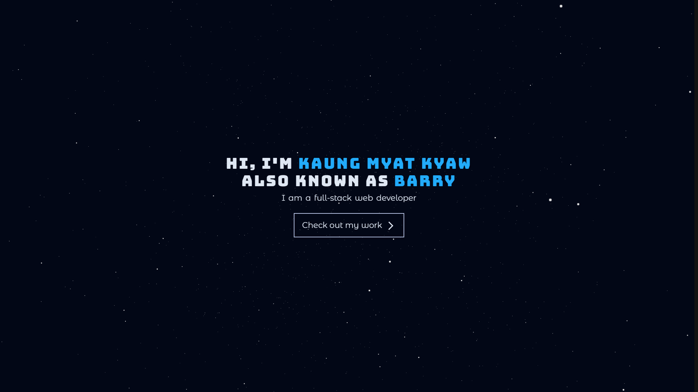
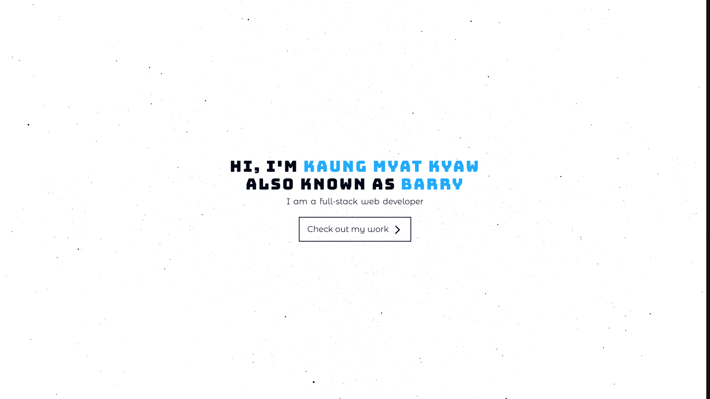

  <h3><b>Portfolio</b></h3>

<!-- TABLE OF CONTENTS -->

# 📗 Table of Contents

- [📖 About the Project](#about-project)
  - [🛠 Built With](#built-with)
    - [Tech Stack](#tech-stack)
    - [Key Features](#key-features)
  - [🚀 Live Demo](#live-demo)
- [👥 Authors](#authors)
- [🔭 Future Features](#future-features)
- [🤝 Contributing](#contributing)
- [⭐️ Show your support](#support)
- [📝 License](#license)

<!-- PROJECT DESCRIPTION -->

# 📖 [Portfolio] 

  
  
   

  <h3><b>Portfolio</b></h3>

> Welcome to my dynamic portfolio, where the fusion of ReactJS, ThreeJS, and TailwindCSS, embellished with captivating animations from Framer Motion, creates an immersive experience. With a mobile-first approach, this responsive masterpiece ensures seamless viewing across devices. Hosted on the powerful platforms of Vercel and Netlify, my portfolio elegantly presents a showcase of creative ventures and professional accomplishments, inviting you to explore and be inspired.

## 🛠 Built With 

### Tech Stack 

  
Client

  <ul>
    <li><a href="https://reactjs.org/">React.js</a></li>
    <li><a href="https://threejs.org/">Three.js</a></li>
    <li><a href="https://www.framer.com/motion/">Framer Motion</a></li>
  </ul>

<!-- Features -->

### Key Features 

- **[3D_star_canvas]**
- **[Light/Dark_theme]**

(<a href="#readme-top">back to top</a>)

<!-- LIVE DEMO -->

## 🚀 Live Demo 

- [Live Demo Link](https://rhbarry.me/)

(<a href="#readme-top">back to top</a>)

<!-- AUTHORS -->

## 👥 Authors 

👤 **Kaung Myat Kyaw**

- GitHub: [GitHub](https://github.com/Rhaegar121)
- Twitter: [Twitter](https://twitter.com/Rhaegar121)
- LinkedIn: [LinkedIn](https://www.linkedin.com/in/kaungmyatkyaw/)

(<a href="#readme-top">back to top</a>)

<!-- FUTURE FEATURES -->

## 🔭 Future Features 

- **[Experience_Section]**
- **[Footer_motion]**

(<a href="#readme-top">back to top</a>)

<!-- CONTRIBUTING -->

## 🤝 Contributing 

Contributions, issues, and feature requests are welcome!

Feel free to check the [issues page](../../issues/).

(<a href="#readme-top">back to top</a>)

<!-- SUPPORT -->

## ⭐️ Show your support 

Give a ⭐️ if you like this project!

(<a href="#readme-top">back to top</a>)

<!-- LICENSE -->

## 📝 License 

This project is [MIT](./LICENSE) licensed.

(<a href="#readme-top">back to top</a>)
